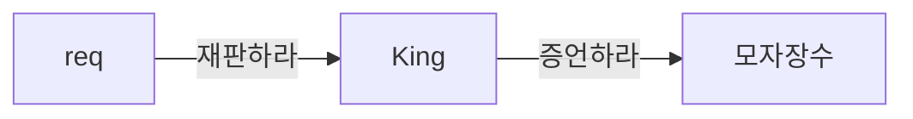

- 객체들은 애플리케이션의 기능을 구현하기 위해 협력하고, 협력과정에서 각자 맡은 책임을 다하기 위해 '자율적' 으로 판단하고 행동한다.

- 자율성 : 자기 스스로의 원칙에 따라 어떤 일을 하거나 자신을 통제해서 절제하는 성질이나 특성

- 자율적인 객체 : 스스로 정한 원칙에 따라 판단하고 스스로의 의지를 기반으로 행동하는 객체

- 객체가 어떤 행동을 하는 유일한 이유는 다른 객체로부터 '요청'을 수신했기 때문이다. 요청을 처리하기 위해 객체가 수행하는 행동을 '책임' 이라고 한다.

- 객체지향 설계 : 적절한 책임을 적절한 객체에게 할당하는 것.

- 책임주도설계가 중요하다
	- 적절한 책임의 선택이 전체 설계의 방향을 결정한다.
	- 적절한 책임이 자율적인 객체를 낳고, 자율적인 객체들이 모여 유연하고 단순한 협력을 낳는다.

